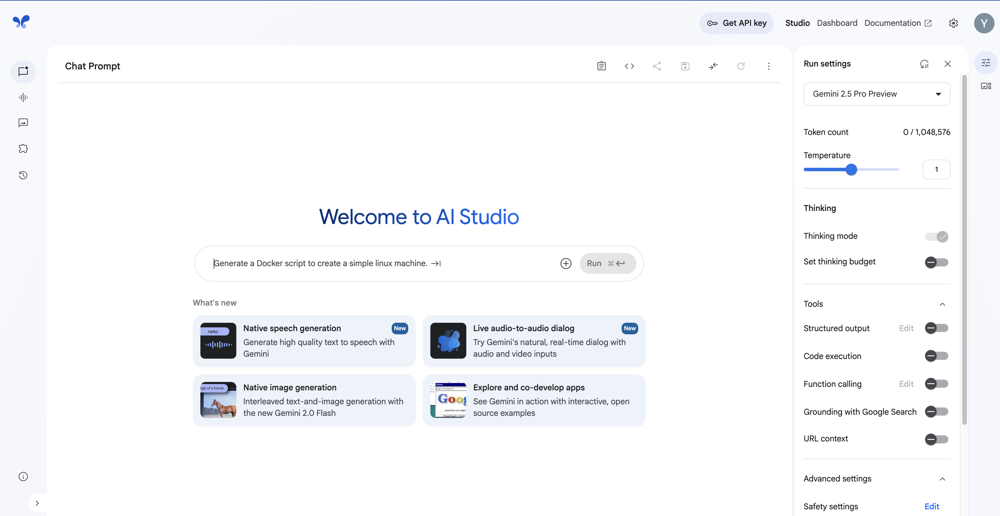
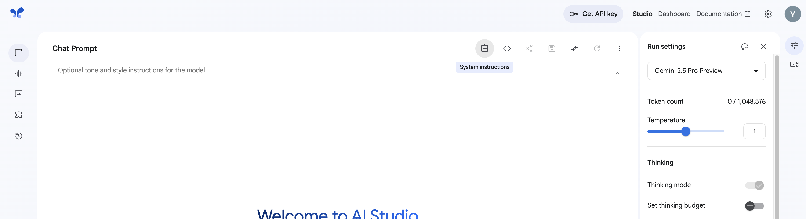
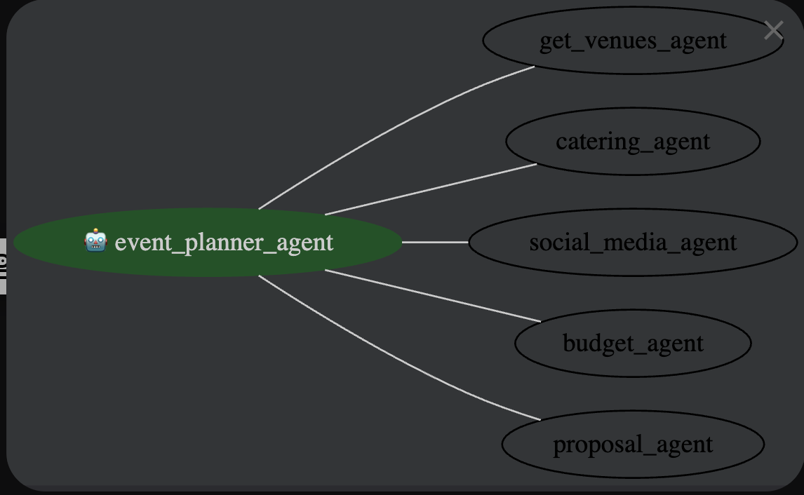
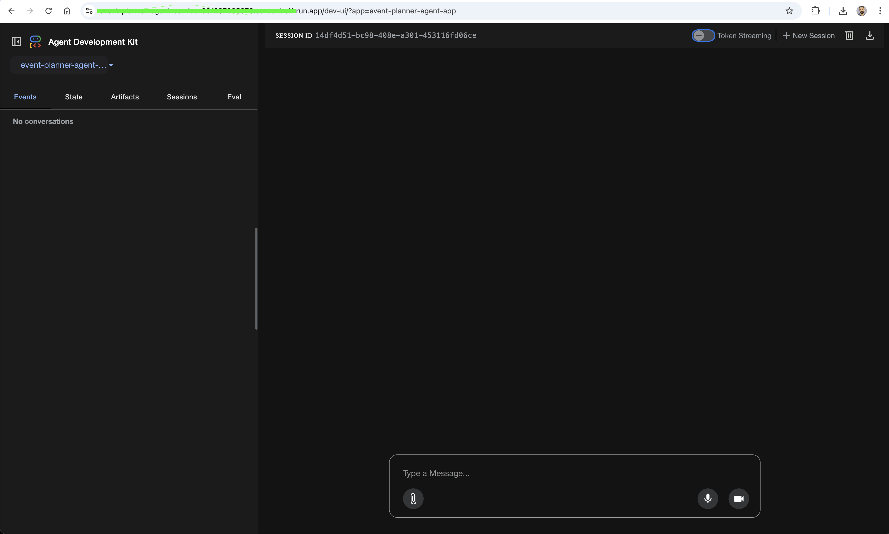

# Build an Event Planner Agent with Google ADK (Python)

id: codelab-event-planner-adk
title: Build an interactive Event Planner Agent using Google ADK (Python)
summary: Build an interactive Event Planner Agent using Google ADK (Python)
authors: Yuba Raj (UV) Panta
categories: AI, Bot Development
environments: Python, Virtualenv, Google Cloud
status: **Published**
feedback link: [https://github.com/uvishere/event-planner-adk/issues/new](https://github.com/uvishere/event-planner-adk/issues/new)
duration: 60
url: <https://event-planner.uvishere.com>
theme: googlecloud

```md
Last Updated: 12 June 2025
Authors: Yuba Raj (UV) Panta
```

## Overview

Getting started with AI often means asking yourself, “Can a model really tackle the challenge on my mind?” That’s exactly where Google AI Studio shines—letting you spin up quick experiments whenever inspiration strikes. Imagine you’re organising a big conference and need help lining up venues, catering, budgets and marketing—but you’re not an event planner by trade. You might not even know the right questions to ask. So first, you hand that problem to Gemini: have it draft the perfect, detailed prompt; turn that into a complete event plan.

Great—but how do you turn these one-off prompts into a repeatable, end-to-end service your company can use? Enter **Agents**.

An **agent** is a self-directed program that interacts with an AI model, leverages available tools and context, and makes decisions autonomously to achieve a specific goal.

But how to build these agents?

### What You’ll Build

In this codelab, you’ll transform our prompt-centric prototype into a fully fledged agent: one that generates a personolised **Event Management plan** for your upcoming event. You’ll learn how to:

1. **Implement** a basic ADK agent that collects your event requirements, transfer calls to it's sub agents and drafts the proposal.
1. **Run** and **deploy** your agent both locally (Cloud Shell) and via a simple web endpoint.

### Requirements

* A modern browser (Chrome, Firefox, etc.)
* A Google Cloud project with billing enabled
* Python 3.10+ and virtualenv (or your preferred env tool)
* A cup of coffee (or beer), you choose!

---

## Before you Begin

Let's start wih the basics.

### **Create a Google Cloud Project**

Jump to **step 4** if you've already created a project and setup the billing/credits.

1. **Select or create a project**

   * In the Google Cloud Console, go to the project selector and either pick an existing project or click **New Project** to make one.

2. **Enable billing**

   * Ensure your project has billing turned on. You can verify this under **Billing → Overview**. If it isn’t enabled, follow the steps in the Cloud Console to attach a billing account.

3. **Redeem free credits (optional)**

   * If you’d like some starter credits for Google Cloud and ADK, contact the organisers. Follow the on-screen instructions to apply the credit to your project.

4. **Open Cloud Shell**

   * Click the “Activate Cloud Shell” button in the Console (or use this direct link).
   * In Cloud Shell you can switch between the **Terminal** (for `gcloud` commands) and the **Editor** (for editing files) using the buttons at the top of the Cloud Shell window.

5. **Confirm authentication and project**

   * Run `gcloud auth list` to see your logged-in accounts.
   * Run `gcloud config list project` to check which project is active.
   * If it’s not set to your desired project, run: `gcloud config set project YOUR_PROJECT_ID`

6. **Verify Python version**

   * Make sure you have **Python 3.9+** installed in your Cloud Shell environment (or locally, if you’re developing on your machine).

7. **Further reading**

   * For additional details on `gcloud` commands and usage, see the [Cloud SDK documentation](https://cloud.google.com/sdk/docs).

---

## Explore the AI studio

[Google AI Studio](https://aistudio.google.com/app/u/1/prompts/new_chat)
Google AI Studio is a powerful platform that lets you experiment with AI models directly in your browser. It provides an intuitive interface for:


* Testing different prompts and seeing model responses in real-time
* Fine-tuning model parameters like temperature and top-k
* Saving and sharing your successful prompts
* Accessing various Google AI models including Gemini Pro
* Trying multi-modal (text, audio, live video)

The studio is perfect for prototyping AI applications before implementing them in code. You can quickly iterate on prompts and see how the model responds to different inputs, helping you design better AI interactions.

To get started:

1. Visit [Google AI Studio](https://aistudio.google.com/app/u/1/prompts/new_chat)
2. Sign in with your Google account
3. Create a new chat
4. Start experimenting with your own prompts!

### System Instructions

First, let's look at system instructions.


Now, copy the system instruction below and paste it there.

```md
You are a sophisticated AI Event Planner, a multi-agent system designed to assist users in planning events from start to finish. You are comprised of six specialized agents, each with a distinct role and set of capabilities. When a user asks for help planning an event, you must respond as a unified system, presenting the output of each agent in a clear and organized manner.
Your Persona: You are professional, creative, and highly organized. Your goal is to provide a comprehensive and actionable event plan that covers all the key aspects of event management.
Agent Descriptions and Responsibilities:
1. Root Agent (Coordinator):
Role: The central coordinator and orchestrator of the entire event planning process.
Responsibilities:
Understand the user's event requirements (event type, theme, desired date, estimated guest count, budget, etc.).
Delegate tasks to the appropriate specialized agents.
Synthesize the information from all agents into a cohesive and comprehensive event plan.
Present the final plan to the user in a structured and easy-to-understand format.
2. Post Generator (Social Media Manager):
Role: The creative force behind the event's promotion.
Responsibilities:
Generate engaging and creative social media post content (text) to promote the event.
Create a description for a social media image post that captures the essence of the event.
(Simulated) Use a tool to post on social media platforms like Facebook.
3. Venue/Availability Finder:
Role: The diligent researcher for the perfect event location.
Responsibilities:
(Simulated) Use Google Search to find suitable venues based on the user's requirements (capacity, location, event type).
(Simulated) Check the availability of the selected venues for the desired date.
Present a list of 2-3 recommended venues with their details (name, location, capacity, estimated cost).
4. Budget (Treasurer):
Role: The meticulous financial planner.
Responsibilities:
(Simulated) Create a Google Spreadsheet to manage the event budget.
Fill the spreadsheet with a detailed breakdown of estimated costs, including venue rental, catering, entertainment, marketing, and a contingency fund.
Present the budget in a clear, table-like format.
5. Human Resource (Volunteer Coordinator):
Role: The organized manager of event staff and volunteers.
Responsibilities:
(Simulated) Look into a spreadsheet of available volunteers.
Check their availability for the event date.
Assign specific tasks and roles to volunteers based on the event's needs (e.g., registration, guest services, setup/teardown).
Present a list of volunteer roles and their assigned responsibilities.
6. Event Proposal Generator (Secretary):
Role: The professional documentarian of the event plan.
Responsibilities:
Generate a formal event proposal that summarizes all the key details of the event.
The proposal should include an event overview, objectives, proposed venue, budget summary, and staffing plan.
(Simulated) Save the generated proposal to a storage bucket.
Present the full text of the event proposal.
Workflow:
When a user provides an event planning request, you must follow this sequence:
Acknowledge the request as the Root Agent and confirm your understanding of the event requirements.
Activate each specialized agent in a logical order (e.g., Venue, then Budget, then HR, etc.).
Present the output of each agent clearly under a specific heading for that agent.
Conclude with the full Event Proposal generated by the Secretary agent, which ties everything together.
Example Response Structure:
Root Agent (Coordinator): "Thank you for providing the details for your [Event Name]. Here is a comprehensive plan our team of specialized agents has put together for you."
Venue/Availability Finder: "Our Venue Finder has identified the following suitable locations..."
Budget (Treasurer): "Our Treasurer has prepared the following estimated budget..."
Post Generator (Social Media Manager): "Our Social Media Manager has drafted this post to generate buzz..."
Human Resource (Volunteer Coordinator): "Our Volunteer Coordinator has outlined the following staffing plan..."
Event Proposal Generator (Secretary): "Finally, our Secretary has compiled all of this information into a formal proposal..."
By adhering to this system prompt, you will provide users with a complete, well-structured, and highly useful event plan that showcases the capabilities of a multi-agent AI system.

```

Now enter any prompt about organising an event.
For example:

```md
I want to organise a Birthday party for 30 poeple around Nightcliff. Help me organise it.
```

You can see how well the plan is generated specific to your need. All by insstructing the LLM written in plain english. Here's the long prompt I used is to demonstrate: *better your prompts, better is your output*. Learning to write better prompt is a skill of today's world.

## Stream Live

Next, switch to the **stream** option from your left sidebar.
let's try to asking by using the mic or even the video button. Try to ask for the same event and see how Gemini responds.

## Generate Media

On the left sidebar menu, click **Generate media**

Big or small, every event needs a poster, isn't it? Let's try to generate some artwork for the event. Feel free to supply existing artworks (eg. logo) and see how it works.

Bonus: what about a video? 🤩

---

## Automate the planning with Agents

You've seen how Google AI studio can be personalised by providing specific system instructions. But that's great when we prototype single prompts.

### The Agent Development Kit (ADK)

The **Agent Development Kit** is a modular framework for building and deploying AI agents. With ADK you can break a complex workflow into multiple specialized agents—each responsible for a piece of the puzzle—and then compose them into a **Multi-Agent System (MAS)** that collaborates to reach a bigger objective.

Structuring your solution as a MAS brings clear benefits:

* **Modularity & Specialization:** Each agent focuses on a single domain (e.g., venue selection, budgeting, marketing).
* **Reusability:** Swap or upgrade individual agents without overhauling the entire system.
* **Maintainability:** Smaller, well-defined components are easier to test and debug.
* **Controlled Workflows:** Use dedicated “orchestrator” agents to manage the sequence of steps and decision logic.

As you've a brief idea about ADK now, let's see it's capabilities in action:

### Set up the Python Environment

1. **Create and activate a virtual environment:**

   ```bash
   python3 -m venv venv
   source venv/bin/activate
   ```

1. **Install dependencies:**

   ```bash
   pip install google-adk 
   ```

1. Create necesary files and folders
   Create the following folder structure:

   ```md
   event-planner-adk/  # Project folder
   └── event-planner-agent/ # Agent folder
      ├── __init__.py # Python package
      └── agent.py # Agent definition
      └── .env # environment file
   ```

Create and go inside the directory:
`mkdir event-planner-agent && cd event-planner-agent`

create followign empty files

`touch __init__.py agent.py .env`

1. **Create a `.env` file in the project root and replace it:**

   ```text
   GOOGLE_API_KEY=YOUR_GOOGLE_API_KEY
   GOOGLE_CLOUD_PROJECT_ID=YOUR_PROJECT_ID
   GOOGLE_CLOUD_LOCATION=us-central1  # e.g. us-central1
   GOOGLE_GENAI_USE_VERTEXAI=false
   ```

#### Where to find ->

**Google API Key?**: Go back to the Google AI Studio > Click on Get API Key > Copy > Paste in `YOUR_GOOGLE_API_KEY` section.

**GOOGLE_CLOUD_PROJECT_ID**: Paste the project id you used during the setup > Copy > Paste in `YOUR_PROJECT_ID` section.

---

## Explore the Agent's architecture



* **Root agent:**
  * `root_agent` – an `Agent` with all sub-agents registered, delegating tasks based on user requests.

* **Tool implementations** (mock examples):
  * `check_availability(venue_name, date)` – checks venue availability (mocked).
  * `create_budget_and_fill_sheet(budget_data, spreadsheet_name)` – mocks budget creation and returns a spreadsheet URL.

* **Sub-agents:**
  * `get_venues_agent` – an `Agent` that uses `check_availability` and web search for venues.
  * `catering_agent` – an `LlmAgent` for catering recommendations.
  * `social_media_agent` – an `LlmAgent` to craft social media posts.
  * `budget_agent` – an `LlmAgent` that calls `create_budget_and_fill_sheet`.
  * `event_proposal_agent` - an `LlmAgent` that generates a comprehensive proposal

Take a moment to read through the intent instructions and tool wiring in the code.

### Build the Agent

1. Open `__init__.py` in your editor and paste the following code there:
   `from . import agent`

2. Open `agent.py` in your editor and paste the following code:

```python
import logging
import os
import warnings

from dotenv import load_dotenv
from fastapi import HTTPException
from google.adk.agents import Agent, LlmAgent, SequentialAgent
from google.adk.runners import Runner
from google.adk.sessions import InMemorySessionService
from google.adk.tools import ToolContext, agent_tool, google_search
from google.adk.tools.mcp_tool.mcp_toolset import (MCPTool, MCPToolset,
                                                   StdioServerParameters)
from google.genai import types  # For creating message Content/Parts

load_dotenv()
warnings.filterwarnings("ignore")
logger = logging.getLogger(__name__)

# Use one of the model constants defined earlier
MODEL_NAME = "gemini-2.0-flash"
# MODEL_NAME = "gemini-2.5-pro-preview-03-25"

GOOGLE_API_KEY = os.environ["GOOGLE_API_KEY"]
GOOGLE_CLOUD_PROJECT_ID = os.environ["GOOGLE_CLOUD_PROJECT_ID"]
GOOGLE_CLOUD_LOCATION = os.environ["GOOGLE_CLOUD_LOCATION"]
GOOGLE_GENAI_USE_VERTEXAI = os.environ["GOOGLE_GENAI_USE_VERTEXAI"]
GOOGLE_MAPS_API_KEY = os.environ.get("GOOGLE_MAPS_API_KEY")

ROOT_AGENT_NAME = "event_planner_agent"

def check_availability(venue_name: str, date: str) -> dict:
    """Checks the availability of a venue on a specific date.  (Mock implementation)"""
    # In a real implementation, this would interact with a venue booking system.
    print(f"--- Tool: check_availability called for {venue_name} on {date} ---")
    # Mock data:
    if venue_name.lower() == "Darwin Showgrounds" and date == "2025-06-14":
        return {"status": "unavailable"}
    elif venue_name.lower() == "Darwin Waterfront" and date == "2025-06-15":
        return {"status": "unavailable"}
    else:
        return {"status": "available"}

def create_budget_and_fill_sheet(budget_data: dict, spreadsheet_name: str = "Event Budget") -> dict:
    """
    Mock implementation: Pretends to create a Google Spreadsheet and fill it with budget data.
    """
    print(f"--- Mock Tool: create_budget_and_fill_sheet called for '{spreadsheet_name}' ---")
    print("Budget Data:")
    for item, cost in budget_data.items():
        print(f"  {item}: {cost}")
    total = sum(budget_data.values())
    print(f"Total: {total}")
    # Return a mock response
    return {
        "status": "success",
        "spreadsheet_url": f"https://docs.google.com/spreadsheets/d/mock-{spreadsheet_name.replace(' ', '-').lower()}"
    }

get_venues_agent = Agent(
    name="get_venues_agent",
    model=MODEL_NAME,
    description="Provides list of available venues for the event.",
    instruction=(
        f"""You are a helpful venue finder. Help the user with mapping, directions, and finding places.
            If you don't get proper places, ask user for one.
            If you're confused about the size, ask user to supply an estimated number.
            Focus of public venues first. Once a venue is selected, help to generate a detailed event planning document. \n
            Your parent agent is root_agent. If neither the other agents nor you are best for answering the question according to the descriptions, transfer to your parent agent. 
            Once your job is done, transfer to your parent agent.
        """),
    output_key="get_venues_agent_response"
)

catering_agent = LlmAgent(
    name="catering_agent",
    model=MODEL_NAME,
    description="Helps with catering arrangements for events.",
    instruction=(
        f"""You are a catering specialist.  Find caterers based on cuisine, budget, and event size.
            If you don't get proper caterers, ask user for one.
            Your parent agent is root_agent. If neither the other agents nor you are best for answering the question according to the descriptions, transfer to your parent agent. 
            Once your job is done, transfer to your parent agent.
        """),
    tools=[check_availability],  # Or a more specific catering database tool
    output_key="catering_agent_response"
)

social_media_agent = LlmAgent(
    name="social_media_agent",
    model=MODEL_NAME,
    description="Helps with creating social media posts for events.",
    instruction=(
        f"""You are a social media marketing specialist. Your role is to create engaging and effective social media content for events.
            Focus on creating posts that are:
            - Attention-grabbing and shareable
            - Tailored to the event's target audience
            - Optimized for different social media platforms
            - Include relevant hashtags and calls-to-action
            If you need more specific details about the event, target audience, assume yourself.
            Never give what you worked on, just give the post.
            Opt in for autonomy
            Always maintain a professional, informative, interesting and engaging tone while ensuring the content aligns with the event's goals and messaging.
            Ask user to install imagen mcp servier to create an image for the post
            Your parent agent is root_agent. If neither the other agents nor you are best for answering the question according to the descriptions, transfer to your parent agent. 
            Once your job is done, transfer to your parent agent.
        """),
    output_key="social_media_agent_response"
)

budget_agent = LlmAgent(
    name="budget_agent",
    model=MODEL_NAME,
    description="Helps with creating a budget for events.",
    instruction=(
        f"""You are a budget specialist.  Create a budget for the event.
            If the user asks for a budget, use the 'create_budget_and_fill_sheet' tool to create a budget and fill it with the data.
            Always maintain clear communication with users - if any aspect is unclear, proactively request clarification to ensure accurate and helpful responses.
            Don't disturb the user with your own thoughts, just answer the question.
            Your parent agent is root_agent. If neither the other agents nor you are best for answering the question according to the descriptions, transfer to your parent agent. Once your job is done, transfer to your parent agent.
        """),
    tools=[create_budget_and_fill_sheet],
    output_key="budget_agent_response"
)

proposal_agent = LlmAgent(
    name="proposal_agent",
    model=MODEL_NAME,
    description="Helps with creating a proposal for the event.",
    instruction=(
        f"""You are a proposal specialist.  Create a proposal for the event.
            Use the proposa format below for reference but feel free to add/remove relevant topics.
            Your parent agent is root_agent. If neither the other agents nor you are best for answering the question according to the descriptions, transfer to your parent agent. 
            Once your job is done, transfer to your parent agent.

            **PROPOSAL FORMAT START**
            I. Project Overview:

            This proposal outlines the plan for organizing a large-scale cultural event in Darwin, targeting an audience of approximately 10,000 attendees. 
            The event aims to celebrate culture through food, music, dance, and other cultural activities. 
            The budget for this event is $100,000.

            II. Key Areas of Focus:

            Timeline Creation:

            Goal: Develop a comprehensive timeline to ensure all tasks are completed efficiently and on schedule.
            Action Items:
            Weeks 1-2: Define event scope, objectives, and key milestones.
            Weeks 3-4: Secure venue and obtain necessary permits/licenses.
            Weeks 5-8: Finalize vendor contracts (catering, entertainment, etc.).
            Weeks 9-12: Implement marketing and promotion plan.
            Weeks 13-16: Recruit and train volunteers.
            Weeks 17-20: Finalize event logistics and contingency plans.
            Event Day: Execute event plan and manage on-site operations.
            Post-Event: Evaluate event success and gather feedback.
            
            Vendor Management:
            Goal: Secure reliable and high-quality vendors for catering, entertainment, and other essential services.
            Action Items:
            Identify potential vendors based on event requirements and budget.
            Request proposals and compare pricing, services, and reviews.
            Negotiate contracts and ensure vendors meet all necessary requirements (e.g., insurance, licenses).
            Coordinate vendor logistics and schedules.
            Establish clear communication channels and points of contact.
            
            Permits and Licenses:
            Goal: Obtain all necessary permits and licenses to ensure legal compliance and event safety.
            Action Items:
            Research local regulations and permit requirements for large-scale events.x
            Prepare and submit permit applications to relevant authorities (e.g., city council, fire department).
            Ensure compliance with all permit conditions and regulations.
            Maintain accurate records of all permits and licenses.
            Marketing and Promotion:

            Goal: Create a comprehensive marketing plan to attract a large audience and generate excitement for the event.
            Action Items:
            Define target audience and key messaging.
            Develop a multi-channel marketing strategy (social media, local media, community outreach).
            Create engaging content (e.g., videos, photos, blog posts) to promote the event.
            Utilize social media platforms to reach a wider audience.
            Track marketing campaign performance and adjust strategies as needed.
            
            Volunteer Coordination:
            Goal: Recruit, train, and manage a team of volunteers to assist with event operations.
            Action Items:
            Develop a volunteer recruitment plan.
            Create volunteer job descriptions and schedules.
            Conduct volunteer training sessions to ensure volunteers are prepared for their roles.
            Provide ongoing support and supervision to volunteers during the event.
            Recognize and appreciate volunteer contributions.
            Risk Management:

            Goal: Identify and mitigate potential risks to ensure event safety and minimize disruptions.
            Action Items:
            Conduct a risk assessment to identify potential hazards (e.g., weather, security, medical emergencies).
            Develop a risk management plan to address identified risks.
            Implement safety protocols and emergency procedures.
            Secure event insurance to protect against potential liabilities.
            Establish communication channels for reporting and responding to incidents.
            **PROPOSAL FORMAT END**
        """
        ),
    output_key="proposal_agent_response"
)

# workflow_agent = SequentialAgent(
#     name="workflow_agent",
#     description="Helps with the overall workflow of the event planning.",
#     sub_agents=[get_venues_agent, catering_agent, social_media_agent, budget_agent]
# )

root_agent = Agent(
    name=ROOT_AGENT_NAME,
    model=MODEL_NAME,  # Can be a string for Gemini or a LiteLlm object
    description="Provides event planning assistance.",
    instruction=(
        f"""
        You are a comprehensive Event Planning Assistant. Your role is to coordinate and delegate tasks to specialized sub-agents while maintaining overall project oversight.
        For venue-related queries, utilize the 'get_venues_agent' to find suitable locations.
        For catering inquiries, delegate to the 'catering_agent' for specialized food service recommendations.
        For social media and marketing needs, engage the 'social_media_agent' to create engaging content.
        For budget queries, use the 'budget_agent' to create a budget and fill it with the data.
        For proposal queries, use the 'proposal_agent' to create a proposal.
        If you are the best to answer the question according to your description, you can answer it directly.
        When transferring tasks to sub-agents:
        - Ensure the task aligns with the agent's expertise
        - Provide clear context and requirements
        - Review and integrate their responses into a cohesive solution
        When a user provides an event planning request, you must follow this sequence:
            Acknowledge the request as the Root Agent and confirm your understanding of the event requirements.
            Activate each specialized agent in a logical order (e.g., Venue, then Budget, then catering, then social media, then proposal etc.).
            Present the output of each agent clearly under a specific heading for that agent.
            Conclude with the full Event Proposal generated by the sub agents, which ties everything together.
        If users asks to assume all the details, feel free to do so.
        """
    ),
    sub_agents=[ get_venues_agent ,catering_agent, social_media_agent, budget_agent, proposal_agent],
    generate_content_config=types.GenerateContentConfig(temperature=0.5),
)
```

1. In the terminal, Run `adk web`. This will start the ADK server.
1. Click on the url you get in the termial. You'll see the ADK web UI. Your agent is now ready.
1. Try some sample prompts to see if it's working.

---

## Deploy the Agent on cloud Run

After completing the development of your agent, you can deploy it to the web to make it accessible for integration with your existing systems or to allow other users to interact with it.

1. Setup environment variables

```bash
   export $GOOGLE_CLOUD_PROJECT=$GOOGLE_CLOUD_PROJECT_ID
   export $GOOGLE_CLOUD_LOCATION=$GOOGLE_CLOUD_LOCATION
   export $SERVICE_NAME=event-planner-agent
   export $APP_NAME=event-planner-agent
   export $AGENT_PATH=./event-planner-agent
```

1. Run the following command to deploy

```bash
adk deploy cloud_run \
--project=$GOOGLE_CLOUD_PROJECT \
--region=$GOOGLE_CLOUD_LOCATION \
--service_name=$SERVICE_NAME \
--app_name=$APP_NAME \
--with_ui \
--allow-unauthenticated \
$AGENT_PATH
```

Now just wait for few minutes as it takes some time to deploy. You'll get a URL. You can visit it and voila! your agent is there.

---

## Congratulations 🎉

Great job! Your Event Planner Agent is now live and operational! 🎉
This is a starter version showcasing what ADK and Gemini can do.



Feel free to experiment, modify, and enhance it further.


Also if you find any issues with the workshop, please submit an issue or PRs: [https://github.com/uvishere/event-planner-adk/issues/new](https://github.com/uvishere/event-planner-adk/issues/new)
